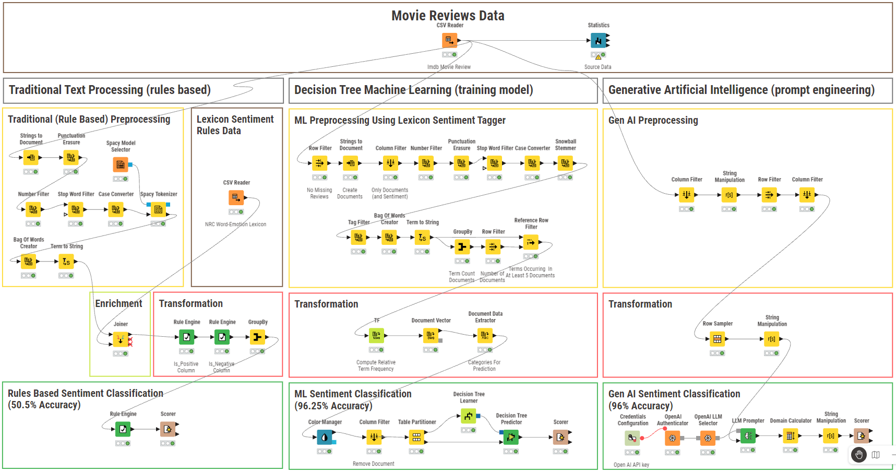

# KNIME Movie Sentiment Analysis
### This work demonstrates use of the KNIME Data Analytics and Workflow Platform to conduct sentiment analysis.

## Project Overview
2000 movie reviews were analyzed, comparing three different scientific approaches for extracting individual opinion or feelings about a film.

While Gen AI can determine positive and negative sentiment with 96% accuracy, machine learning is well suited to the task, providing consistently reproducible results (96.25% accuracy) and better return on investment, not requiring the additional processing expense of Gen AI.

## Approach
Determine the most efficient method to determine sentiment by comparing the accuracy of three approaches:
1. Traditional Text Processing based only on a well defined set of rules
2. Decision Tree Machine Learning training model
3. Generative Artificial Intelligence

## Data
<strong>IMDB-sample.csv</strong>
 Description: Movie Reviews from the Internet Movie Database
<!--  Source: [KNIME Public - Education data](https://hub.knime.com/knime/spaces/Education/Courses/L4-TP%20Text%20Processing%20-%20Specialization/data) -->
Source: 
<a href="https://hub.knime.com/knime/spaces/Education/Courses/L4-TP%20Text%20Processing%20-%20Specialization/data" target="_blank" rel="noopener noreferrer">KNIME Public - Education data</a>
 Row Count: 2000 +header 
 Four Columns:
- Index (Unique Identifier)
- URL (User Specific ID)
- Text (User Comment)
- Sentiment (Predetermined positive {POS} or negative {NEG} classification )

<!--   -->
<strong>NRC-Word-Emotion-Lexicon.csv</strong>
 Description: List of English words and their association with positive or negative sentiment.
 Source: [NRC Word-Emotion Association Lexicon](https://saifmohammad.com/WebPages/NRC-Emotion-Lexicon.htm)
 Row Count: 14,154 +header 
 Two Columns:
- term (English word)
- Sentiment (Predetermined positive {POS} or negative {NEG} classification)
 Note: Original 1/0 changed to POS/NEG for analysis.

## Solution
1. Install the KNIME platform and Extensions according to the specifications listed below in the Tech Stack.
2. Download the data (.csv) files as needed to execute different branches of the workflow.  NOTE: The Generative AI workflow requires a OpenAI subscription.
3. Download [KNIME-Workflow-MovieSentimentAnalysis.knwf](https://drive.google.com/uc?export=download&id=1quOqaI6Lb8T1lI-uGOzJSaZ--cVnv3DB) file.

Most Effective Workflow: Decision Tree Machine Learning (training model)
- KNIME’s Tag Filter node was used to identify and label relevant parts-of-speech associated with emotion (e.g. adjectives, nouns, and verbs) to aid machine learning in identifying positive and negative sentiment ([University of Pennsylvania, 2003](https://www.ling.upenn.edu/courses/Fall_2003/ling001/penn_treebank_pos.html); [KNIME, n.d.](https://hub.knime.com/knime/extensions/org.knime.features.ext.textprocessing/latest/org.knime.ext.textprocessing.nodes.preprocessing.tagfilter2.TagFilterNodeFactory2)).  
- When configuring the Decision Tree Learner, the Gini Index was chosen as the quality measure, showing advantages for faster computation over Gain Ratio as it operates on the categorical target variables in terms of 'success' or 'failure' ([Analytics Steps, 2021](https://medium.com/analytics-steps/understanding-the-gini-index-and-information-gain-in-decision-trees-ab4720518ba8)).  
- The tree was not pruned, and ‘Reduced Error Pruning” was enabled along with capping the number of records per node at 2, to improve training accuracy while preserving learning efficiency.

We observed a higher Cohen’s kappa value (0.925) for this approach.  This measure solidifies our confidence in this improved model where the target classes (positive and negative sentiments) are balanced within the dataset and high values are expected for strong models ([KNIME, 2020](https://www.knime.com/blog/cohens-kappa-an-overview?pk_vid=ae0debe8dfb2ebfe1764604577aca348); [New Stack, 2022](https://thenewstack.io/cohens-kappa-what-it-is-when-to-use-it-and-how-to-avoid-its-pitfalls/)). 

 
 

## Tech Stack
System Specifications:
- [KNIME](https://www.knime.com/) Version 5.8.0 - Build October 15, 2025
- Minimum OS: Windows 11 Operating System
 16 GB RAM, Core i7 CPU @ about 1.80 GHz, SSD HD

KNIME Extensions:
- KNIME Text Processing
- KNIME AI Extension
- Redfield NLP Nodes
 - Spacy Tokenizer
 - Spacy Model Selector
 
- KNIME Javasnippet Nodes
 - Rules Engine

<a href="https://github.com" target="_blank" rel="noopener noreferrer">GitHub in new tab</a>
